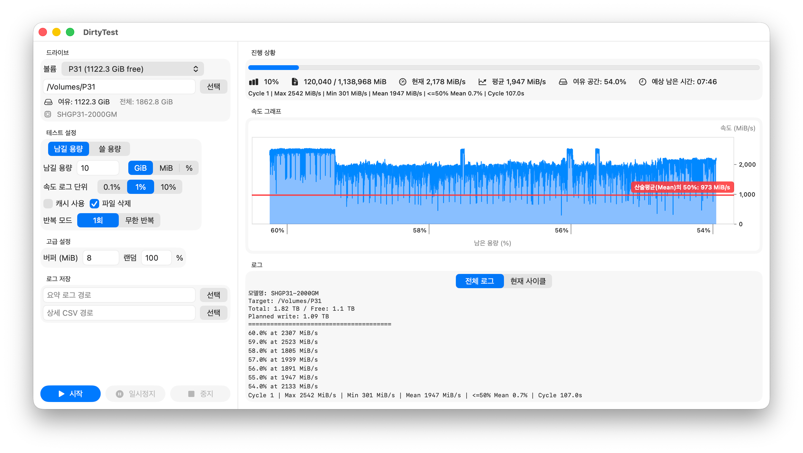

Naraeon Dirty Test macOS 포팅
========

이 저장소는 Naraeon Dirty Test의 macOS 비공식 포팅 버전입니다.

- 원래 프로젝트는 [ebangin127/ndtest](https://github.com/ebangin127/ndtest)를 참고하세요.
- 라이선스: GPL 3.0

## 다운로드

- Win32 바이너리 다운로드: http://naraeon.net/en/나래온-더티-테스트-다운로드
- macOS 설치 버전 (ZIP): [최신 릴리스](https://github.com/kw-lee/ndtest/releases/latest) (Assets에서 ZIP 파일 다운로드)

## macOS 포팅 문서

- 빌드/실행/패키징 가이드: [macos/README.md](macos/README.md)
- 실행 시 차단 문제가 있으면 [macos/README.md의 Gatekeeper 우회 섹션](macos/README.md#github에서-다운로드한-경우-gatekeeper-우회)을 참고하세요.

macOS 빌드는 `DirtyTest` 이름으로 배포되는 비공식 포크 버전입니다.
이 소프트웨어의 사용에 따른 모든 책임은 사용자에게 있으며, 개발자는 프로그램 사용으로 인한
어떠한 부작용에도 책임지지 않습니다. 자세한 내용은 GPL 3.0을 참고하세요.

## macOS 포팅 상태

- 공통 테스트 엔진을 `DirtyTestCore`로 분리
- 네이티브 CLI 타깃: `dirtytest`
- 네이티브 SwiftUI GUI 타깃: `dirtytest-gui`
- 디스크 모델명 감지: diskutil + IOKit 이중 폴백, APFS/물리 디스크 자동 탐색
- GUI 설정에서 남길 용량 모드 + 쓸 용량 모드 지원
- 테스트 중 일시정지 / 재개 기능
- 속도 차트: 파란 영역 + 빨간 50% 평균(산술 평균) 기준선
- 상태 바에 현재 속도 + 실시간 누적 평균 속도 동시 표시
- 로그 뷰 2종: 전체 로그 / 현재 사이클 로그
- 무한 반복 모드에서 사이클 재시작 시 차트 및 로그 자동 초기화
- About 패널에 포크 안내 + GPLv3 고지 포함
- 선택적 아이콘 생성이 가능한 `.app` 패키징 스크립트

빌드 및 실행 상세 내용은 [macos/README.md](macos/README.md)에 정리되어 있습니다.
